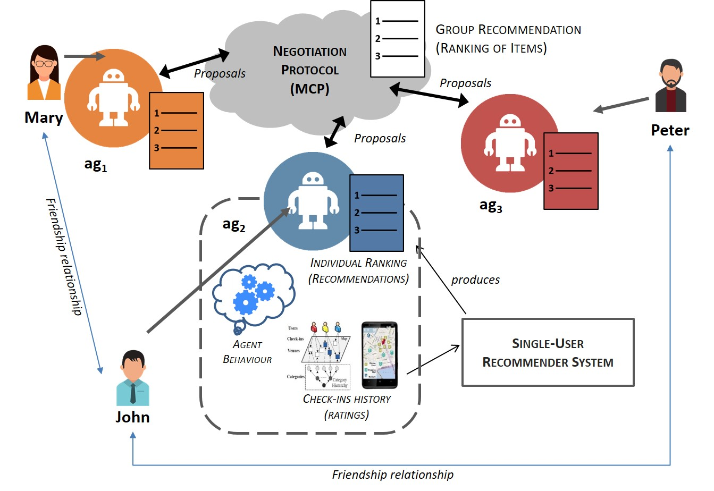

# magres
MAS-based group recommendation: MAGRES

This repository contains information about the main characteristics of the proposed group recommendation approach and the experimental evaluation of MAGRES for recommending POIs for group of users. 

Our proposed approach, called MAGReS (Multi-Agent Group Recommender System), consists of a multi-agent system (MAS) in which each agent represents a group member (or user within the group). MAGReS uses a similar idea than the approaches based on recommendation aggregation, but instead of using of regular aggregation techniques (such as average or least misery) it uses a MAS to select those individual recommendations that will be part of the group recommendations.

In MAGReS, each agent has access to a user profile that contains the user's preferences regarding POIs and it is capable of (i) predicting the rating the user would assign to a POI not yet rated, and (ii) generating a ranking of potentially interesting POIs for the user. Initially, the user's preferences are the ratings assigned by the user to the POIs she rated in the past. Also, the agent keeps information about the user's social network and geographical information about the places rated or marked as “check-ins”. MAGReS replaces the traditional aggregation techniques by a negotiation process in which a group of User Agents (agents representing the users) try to reach a consensus on the most satisfying items for the group. Despite that many negotiation protocols are available, only a few of them address two important properties for us, namely: (i) mimic the negotiation process followed by humans (which could boost the quality of the recommendations produced), and (ii) be suitable for multilateral negotiation. Considering these issues, we chose the protocol known as MCP (Monotonic Concession Protocol), a multilateral negotiation protocol proposed in (Endriss, 2006) where a set of cooperative agents negotiate over proposals in order to reach consensus over those proposals to guide the negotiation. A general overview of our approach is shown in the figure above.

A description of the approach and the experimental evaluation can be found in the project Wiki

Contact Information: 

- Jorge Andrés Díaz Pace - ISISTAN (CONICET - UNCPBA) - adiazpace@isistan.unicen.edu.ar
- Silvia Schiaffino - ISISTAN (CONICET - UNCPBA) - silvia.schiaffino@isistan.unicen.edu.ar
- Daniela Godoy - ISISTAN (CONICET - UNCPBA)
- Yves Demazeau - LIG - Grenoble
